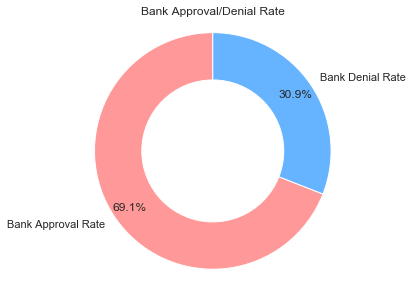

# **Mortgages and Home Loans: know the who/what/why**
## **Dataset information**
### **Citation**
**Home Mortgage Database**: https://ffiec.cfpb.gov/data-browser/data/2018?category=states&items=NY   
Data on 570,380 New York State home mortgage application for the year 2018 is provided by the **Federal Financial Institutions Examination Council** under the Home Mortgage Disclosure Act.  
 
**LEI API**: https://www.gleif.org/en/lei-data/gleif-lei-look-up-api/access-the-api#  
Lender institutions in our dataset are identified by LEI codes, this API used to find corresponding names of institution lenders.  
 
**Bank vs Non-Bank Lender Database**: https://www.occ.treas.gov/topics/charters-and-licensing/financial-institution-lists/index-financial-institution-lists.html  
The heart of this project is to identify the pros and cons of bank lenders and non-bank lenders. This databse allows us to identify if a lending instiution is classified as a bank lender (offers checking/savings services) or as non-bank lender (no checking/savings services).  
 

## **Goal and Purpose** 
In 2019, homeownership rate in the United States amounted to 65.1% and the average home price sits at $284,600.  As more and more adults partake in purchasing their first home, many seek the need for a home loan and subsequently a mortgage. However, with so many services and options available, what loan is right for you? Should you borrow from a bank institution or non-bank institution? What is a competitive and fair interest rate? What are my chances of preapproval?  

These same questions arose as my parents recently went through the home mortgage process and the fustration and confusion that clouded the joy of a prospective new home prompted me to do this project in hopes of answering these very questions. The home mortgage process is undoubtedly a stressful and confusing process. I hope the results and findings of this project can better inform future home buyers of their options and make home buying lessstressful, as it should be. 

**A word on Bank lenders vs Non-Bank lenders:**  
The United States economy is largely dependent on the mortgage industry; the two are so intricately linked, movement in one can directly cause a change in the other. Historically, most individuals know mortgages to be originated from traditional banking institutions. However, non-bank lenders have risen dramatically within the last decade to meet the demands of homebuyers as well as to disrupt the mortgage process.
  
Non-bank lenders are financial institutions that do not offer full-fledged banking services such as lending and depositing services but offer diverse home financing routes. They have left expanding footprints on the home mortgage process, hoping to make the process easier and more efficient. 
  
This analysis seeks to discover why non-bank lenders are more appealing to some applicants and the pros and cons associated with working through  non-bank lenders versus traditional bank lenders.  
 

# Findings/Results
For sake of readability of this README.md file, data cleaning/processing ad exploratory data analysis can be found in **Approved-Denied-Loans** Jupyter Notebook. Results and analysis of the study is replicated below:  

### **Proportion of non-bank lenders and bank lenders within our dataset**
   
**Observation:** Out of the 431,272 prospective home buyers in New York State, 65.74% utilized traditional bank lenders while 34.26% utilized non-bank lenders. While bank lenders still account for two-thirds of all applications, the popularity of non-bank lenders is evident as it makes up over one-third of all applications. This signals that a majority of home buyers are becoming increasingly knowledgeable in their options when it comes to mortgages and are aware that mortgages do not only originate in banks, which is traditionally known to be the case.    
Several factors could contribute to this proportion we observe; the first being that bank lenders are generally much more accessible to home buyers than non-bank lenders. For example, bank lender giants such as JPMorgan Chase & Co and Bank of America have 5,000 and 4,300 financial branches respectively across the United States. When pitted against a non-bank lender such as Better Mortgage Corportion, which typically is of smaller scale, bank lenders have much greater presence and ability to attract home buyers. The deep-rooted knowledge most Americans have on the home-buying process generally leads them to the traditional bank route, as their institution for personal banking matters becomes the most accessible financial institution to originate their loan. 
   
On the other hand, the rise of non-bank lenders can partially be accredited to the technological evolution we have been experiencing in the past decade. Home buyers no longer have to visit their local bank branch to obtain a loan. The rise of the Internet and optimal search engines have given home buyers easy access to other choices right at their fingertips. With a simple Google search, home buyers are able to "shop" around for the best deal, not only on their homes, but on the mortgage buying process. Non-bank lenders can easily excel in this arena because most are structured to be more technologically advanced and are also very customer service based, wanting to make the entire process as easy as possible. This is usually not the case when it comes to bank loaners, who are confined by traditional processes and the bureaucratic process of approving loans. Buying a home is stressful as it is, so the appeal of non-bank lenders with their various perks can be very attractive.  
 

### **Average interest rate between bank lenders and non-bank lenders.**
   
**Observation:** Within the world of mortgages, everyone wants to boast of the lowest interest rate to bring in more home-buyers. In actuality, the average is not that far off comparing the two lender types with the bank lender having a marginally lower rate.
  
The question that arises is, who would benefit more from which type of loan? What does this mean to borrowers when they are looking for a mortgage? - short answer is that they have to lay out all the characteristics they have whether it's their credit, circumstances, market, home value, etc. to see where they can acquire the best deal. 
  
The long answer will mean a deeper dive into the types of applicants who go to each type of lender. The similar interest rate amongst the two can be because the preconditions individuals possess before they go to the lender. For instance, an individual with amazing credit, low debt-to-income ratio, more knowledge of the process, or anything else involved with the process, will very likely be able to obtain a lower interest rate at a traditional bank lender. Then the question becomes: will this same individual obtain an even lower rate at a non-bank lender? And vice versa for the buyers who went with the non-bank lenders?  
 

### **Interest Rate by Race Between Lender Type**
   
**Observation:** By graphing interest rates by race groups, White homebuyers have interest rates on par with the overall interest rate at 4.24%. Black homebuyers have the same interest rate average at both banks and non-bank lenders at 4.32%, which is .08% higher than the average. Both White and Black homebuyers have no significant difference between the types of lenders and rates they receive. Asian homebuyers experience lower interest rates than the average when they go through a traditional bank lender and a higher than average when they go through a non-bank by .17%. 
  
Like Figure 8, the data shown here shows that both banks and non-bank lenders are able to offer competitive rates. And the same questions exist: what pre-conditions lead homebuyers to go with a bank or a non-bank? Why do Black homebuyers experience higher rates on average? Why are the interest rates of non-bank and bank differ so significantly for Asians?  
 

### **Is a certain demographic race more likely to finance with bank or non-bank lender?**
   
**Observation:** Given this barplot and as stated above, there is an evident lack of representation of Hawaiian/Paific applicants which will hinder our analysis regarding that race group. Nonetheless, we see that more Asian and White applicants apply for loans via bank lenders. When considering our prior observation that roughly two-thirds of applicants apply via bank lenders, the difference in percentage, show that Asian and White applicants apply vai non-bank lenders at a rate that is higher than 34.26%. For Black applicants, non-bank applicants double that of bank appplicants. 
   
Apart from Black applicants, we observe a similar distribution amongst bank lenders and non-bank lenders. An appealing characterisitc of non-bank lenders is their flexibility and willingness to work with applicants who's credit or income is low. Let's see if this is actually the case and how income and race influences which path an applicant pursues.  
 

### **How do Race and Income influence which financing route?**
   
**Observation:** The clustered bar charts above provide insight into how income and race influences an applicant's decision to finance with a bank lender or non-bank lender. Keeping in mind that bank lenders consitutues two-thirds of all applicants and the data is processed in which each income bin is normalized to 100%, we expect to see every Orange bar (Non-Bank) hovering around 34% and every Blue bar (Bank) hovering around 66%. This is visually expressed when the Orange bar (Non-Bank) is half the height of the Blue bar (Bank). This is our basis for comparison across income bins as Blue/Orange bars that do not meet our expected distribution of 66/33 signifies there is a bias higher proportion of bank lenders or non-bank lenders that is directly correlated to race or income.
  
**Asian:** Examining Asian appplicants, we see that applicants whose income ranges from \\$50k to \\$150k adheres to our expected observation, that non-bank lenders constitutues 33% of the data within the bin and bank lenders 66%. When we look at polar ends, our expectation does not hold as the distribution is more extreme. For Asians whose incomes range below \\$50k, 73% financed with Bank lenders and 27% with Non-Bank lenders. This shows that Asians whose income is below \\$50k finance with Bank lenders at a 7% higher rate than the overall distribution. On the opposite end, as income increases from \\$150k, more than 66% of each income bin finance with bank lenders. We see that across all income bins, Asians either finance with bank lenders at our expected 66% rate that increases in relation to income. 
  
**White:** For White applicants, we can observe a similar distribution to Asians but with slight differences across bins. Appplicants' whose income are under \\$200k follows our expected distribution of roughly one-thirds non-bank lenders and two-thirds bank lenders. Unlike Asians who fall within the (0,50] income bin that reflected a higher proportion of bank lenders, this is not the case for White applicants under the same income bin. For incomes over \\$200k, White applicants finance with bank lenders at a rate higher than 66%, reaching as high as 85% disparity. Like the distribution of Asians, White distribution exhibits that across no income bins do we see non-bank lenders proportion exceed past its expected value of 34%. 
  
**Black:** Unlike our White and Asian applicants' data, the distribution of our Black applicants' data has greater variance amongst income bins. Black applicants whose income is below \\$50k meets our expected 66%-33% distribution, but non-bank lender percentages rises substantially as income rises. For Black applicants whose income falls between \\$100k and \\$200k, there is an obvious emphasis on non-bank lenders as approximately half of applicants within this income bin finance with non-bank lenders rather than just one-thirds. For incomes exceeding \\$200k, Black applicants still finance with non-bank lenders at a rate of 40%. This distribution is extremely practical in that it shows that within the housing demographic as a whole, Black applicants are much more likely to finance with non-bank lend
  
**Takeaway:** The distributions and charts illustrated above are practical in its ability to highlight certain trends and the financial routes expressed by different racial/income groups within the housing demographic. Black applicants are much more likely to finance with non-bank lenders, especially when their income falls between \\$50k-\\$250k. From this information, we may question why Black applicants finance with non-bank lenders at a much greater rate than Asians or Whites. For Asians and Whites, we see that as income falls below \\$100k, these applicants apply via non-bank lenders at our expected rate of 34% while those of higher income finance with bank lenders at a substantially higher rate. What is clear across all our distributions is that as income exceeds \\$200k, bank lenders consitute the majority of applicants regardless of race. We may acknowledge that such applicants with high incomes typically yield better credit scores and have higher chances of securing their approved desired loan. As such, the incentives that non-bank lenders offer such as competitive rates, higher loan amounts and leniency with credit may be irrelevant amongst higher income applciants. On the lower end of the income spectrum, these applicants have less income to cover debt and poses as much greater risk for lenders, but a prime marketing target for non-bank lenders. Let's proceed to examine approval rates by lender type and analyze whether lower income applicants with higher debt-to-income ratios really have approval rates with non-bank lenders.   
 
**At this point in the analysis, we know bank lenders comprise of two-thires of all New York mortgage applications and non-bank lenders constituting roughly one-thirds. However, as shown within our analysis above, the distributions based on `race` and `interest_rate` across both types of lenders are strikingly similar and do not effectively explain the differences between the two lenders and why non-bank lenders are becoming more appealing. Both lenders offer an average rate of 4.24% and when analyzing which demographic of applicants are more likely to finance with non-bank lenders, we see that applicants who are Black and are of middle to low income are the most likely to finance with non-bank lenders as over 50% of such applicants do so in comparison to our 34 across all races and incomes. Furthermore, Asians of low and high income finance with bank lenders at a higher rate whereas middle income Asians finance with bank lenders at our expected 66%. We also see that regardless of race, those with high income finance with bank lenders at a much greater rate than non-bank lenders. This information complements the role of non-bank lenders, that is, appealing to applicants of low-income and those with lack-luster credit while offerring similar interest rates and potentialy higher approval rates. On the topic of applicants' credit, A critical factor in determining an applicant's elgibility for loan approval is their `debt_to_income_ratio` (DTI), the percentage of a consumer's monthly gross income allocated towards debt payment. Lenders typically favor applicants with <36% DTI ratio and those over 50% DTI are classified as high risk applicants that typically result in higher interst rates, lower loan approval, or denial.   
Let's look at approval/denial percentages by lender type.**  
 

### **Approval/Denial Rate (Bank lender vs. Non-Bank Lender)**
   
**Observation:** At a glance, non-bank lenders approved 83.4% of all their applicants whereas bank lenders approved applicants at a lower rate of 69.1%. Likewise, bank lenders denied applicants more often than non-bank lenders, 30.9% to 16.6%. Given that both types of lenders offer competitive interest rates, non-bank lenders are more appealing as their acceptance rate is reflective of them accepting higher risk applicants with lack-luster credit.
  
Overall, banks approve less and reject more, which is expected given the characteristics of traditional corporation banks. Banks typically operate with a sense of bureaucracy in place that results in processing systems that are very lenient and common in larger banks such as JPMorgan CHase & Co or Bank of America. Home loans from such banks follow a inflexible processs where home buyers have to be cookie cutters to get the loan they want by matching neccessary income/debt ratios, credit, purchasing power, etc. This aspect may contribute to why Bank lender rates are slightly lower than non-bank lenders, as the entire package of these individuals who are predisposed to be approved at banks are already more attractice and know exactly what they need and what loans they cans secure before applying via a bank lender. 
  
On the other hand, non-bank lenders approve more and reject less. Given that the majority of such lenders are of small scale institutions that lack the influence big banks possess, they are more lenient in terms of working with a home buyer to ensure their business. By focusing more on serving the consumer, such banks are willing to work around factors that banks are less inclined to deal with. As llustrated in charts above, non-bank lenders are more popular amongst applicants of low income and their flexibility may attract consumers with subpar credit/income-debt ratio. Given non-bank lenders approve more and provide a chance of home ownership to applicants rejected by banks, their slightly higher interest rate may account for the larger risk they bear with these applciants.  
 

### **Effect of Debt to Income Ratio on *approval rate* between 2 types of lenders**
  
**Observation:** The two approval distributions between bank and non-bank lenders compare approval rates across different debt-to-income ratios. As introduced earlier, an applicant's debt-to-income ratio is the percentage of a consumer's onthly gross income allocated towards debt payment. DTI ratio is directly correlated with an applicant's credit with a higher DTI ratio signalling sub-par credit and lower ratio representing better credit. If the ratio is too high, lenders are less inclined to provide a loan or will do so at a much higher rate as there is a higher risk associated with repaying the loan. Following this statement, we see that both types of lenders approve aplicants at a similar rate when their DTI ratio is less than 20%. Lenders favor applicants with a DTI ratio under 36% and our distribution shows that for ratios between 20% and 36%, non-bank lenders approved on average 6% more applicants than bank lenders did. This disparity is even more extreme when considering DTI ratios greater than 50% which marks an applicant as high risk. Non-Bank lenders approval rate for applicants with 50%-60% DTI ratio was almost double that of Bank lenders and those deemed high risk of over 60%, non-bank lenders approval rate was three times that of bank lenders. The risk that banks lenders are willing to take is much lower than non-bank lenders when looking at approval rates with high risk applicants. In addition to our exploration on income, we see that applicants of low income and higher DTI ratios, which are correlated, are two to three times more likely to be approved under a non-bank lender.  
 

### **Effect of Debt to Income Ratio on *denial rate* between 2 types of lenders**
  
**Observation:** When visualizing denial rates by lender type across different DTI ration categories, our observation above is supported. For ratios under 50%, the denial rates between bank lenders and non-bank lenders were similarly distributed, but DTI ratios greater than 50% show a much greater denial rate by bank lenders. When looking solely at Bank lender denial rates, we see that the the majority of applcants whose DTI fall within 50% and 60% are denied while an astounding ~93% are denied when DTI is >60%. While non-bank lenders stil deny 78% of applicants within the >60% DTI bin, this denial rate is substantially lower than a bank lenders. In conclusion, we see strong evidence that suggests non-bank lenders are more appealing and a realistic route for those with higher DTI ratios or bad credit as such lenders are willingly to take on the risks.   
 
**What We Know So Far:** Our analysis to this point have shown that both types of lenders have very similar average interest rates and that non-bank lenders may be more appealing to applicants with sub-par credit or whose debt-to-income ratio is greater than 50%. Given a DTI ratio of 50%-60%, such applicants fare double the chances of approval and triple the chances of approval with >60% DTI when applying via a non-bank loan.  
 

### **Overall Denial Rate by Race**
  
**Observation:** With an overall denial rate of 25.21% across all races as indicated by the red horizontal line, we see that there are some races whose denial rate is greater than or less than the state average. With exception to Hawaiian/Pacific which we refrain from drawing conclusions from due to lack of data, observe that White applicants denial rate is slightly lower than that of the average. Black applicants experience the greatest disparity with a denial rate of 40% that is 15% over the state average. Next, we see Asians also experience a greater denial rate at 28%. Within the mortgage application process, an applicant is more likely given bad credit that is evident via high debt-to-income ratios. Higher debt-to-income ratio is typically a result of accruing debt despite a lower income. Let's examine if each races' average income is in line with its average denial rate.  
 

### **Average Income by Race**
  
**Observation:** The chart above details the average income across our races. When coparing this chart to our denial rate chart directly above, we see that income is associated with denial rates. For White applicants, we see their average income is slightly above the overall average income and in relation, their denial rate sits slightly below the state denial benchmark. For Black applicants, their average income is approximately \\$40k below state average and in relation, their denial rate is 15% higher than the state average. In addition to our assumption that lower income results in higher debt-to-income ratios that in turn, increases denial rates, these charts highlight a strong association between income and denial rates that differ across races. White and Asian applicants have an average income hovering around the overall state income and in turn, their denial rates also hover aroung state denial rate averages. For Black applciants whose income is almost 33% lower than the state average, there is an evident increase in denial rates that suggests a strong crorrelaton between the two factors.  
 

### **Denial Rate by Lender Type across demographic races**
  
**Observation:** This chart illustrates that regardless of race, bank lenders deny applicants at a rate that is higher than the state average. On the other hand, we see that non-bank lenders deny all races at a rate under the state average with exception to race listed as "Other". Earlier in our analysis, we examined overall approval and denial rates between bank lenders and non-bank lenders that showed us bank lenders denied 30.9% of all applicants and non-bank lenders denying 16.6%. Using this information, we can see that some races such as White or Asian typically adhere to this distribution. However, for Black applicants, we see their denial rates for both types of lenders is substantially higher. Black aplicants were denied by bank lenders at a 53.63% rate compared to their overall 30.9%. Non-bank lenders denied 22.32% of Blacks compared to their 16.6% overall denial rate. What we can deduce from this is given a Black applicant, their chances of denial are doubled given they finance with a bank lender. The disparity between Black denial rates and overall denial rates for each lender type highlights the stark differences between bank lenders and non-bank lenders. For instance, bank lenders denied Black applicants at a rate. that is 23% higher than their average whereas non-bank lenders denied Blacks at a 6% higher rate. This shows that given an applicant's information, race, income, etc, there are clear advantages and disadvantages when choosing to finance with a bank lender of non-bank lender.  
 

